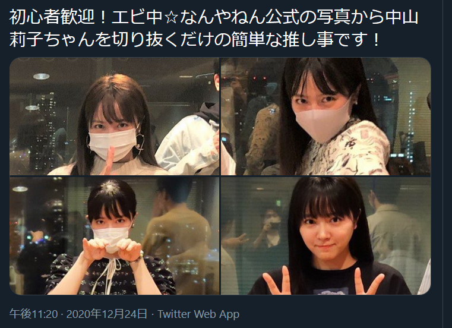

# riko_detection
中山莉子さんを自動検出して切り出す

 

https://twitter.com/matudaieeeera/status/1342112905618018305

を見て、やってみようと思った。

# 環境について

以下の環境で動作を確認している。

* Windows 10 + WSL2 (Ubuntu 20.04.1 LTS)
* CUDA 11.0

face-recognitionがMacとLinuxを公式でサポートしているようなので、手軽に動かすのであれば
MacかLinuxを使用していただければいいと思います。(Windowsのサポートは非公式の模様)

# セットアップ方法

> pip install -r requirements.txt

とやってもらえば、いけるはず。

依存ライブラリは、requirements.txtを参考にしてくださいませ。

主要なところでいうと以下のようになる。

* Python (3.8.5)
* PyTorch (1.7.1+cu110)
* opencv-python (4.4.0.46)
* face-recognition (1.3.0)

# 簡単な動かし方

```python
from connect_detection_face_recognition import connect

connect(["test_riko.png"], "test.csv", "../data/faces/")
```

1. 切り出したいファイルのパスをリストで与える
1. 顔認証で使う顔写真と誰なのかの対応をCSVファイルで作り、CSVファイルのパスを与える
1. CSVファイルで与えたファイルが存在するディレクトリのパスを与える

これを実行すれば、切り出したいファイルに人が映っていれば、実行したディレクトリに
ファイルが出力される。

コンソール上には以下のようなメッセージが出力される。

例
```
$ python example.py 
Image not saved.
test_riko.png_result_1.jpg saved.
test_riko.png_result_2.jpg saved.
Image not saved.
Image not saved.
Image not saved.
Image not saved.
Image not saved.
```

# 制限事項と既知の問題点など

* マスクをした人の写真に関する挙動は未確認。
* 実行するたびに結果が変わってしまう。(調査中)